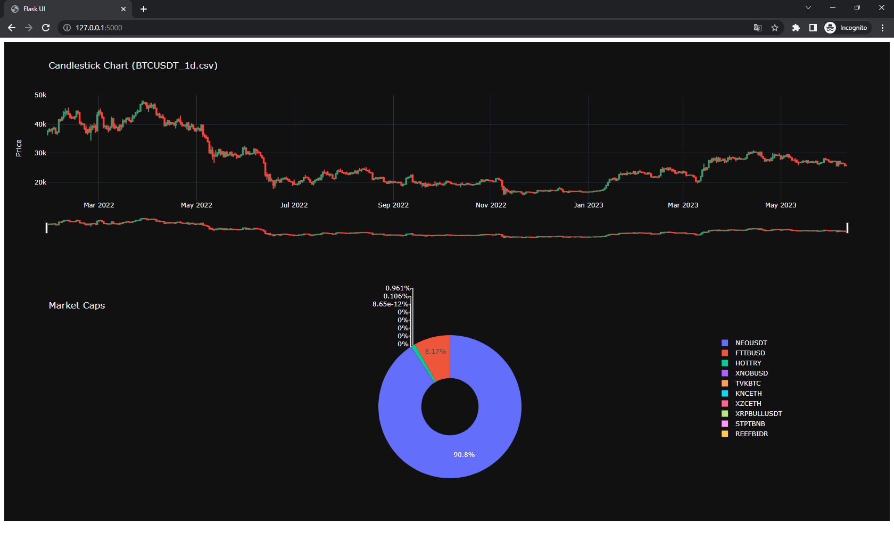

# binance_script

This project is a Python script that fetches data from the Binance API at regular intervals and saves the data to both a
CSV file and a SQLite database. The project also includes a config.json file for specifying the API key, symbol, and
interval.

# Getting Started

1. Clone the repository to your local machine.

2. Install the required Python dependencies by running the following command:

    ```
    pip install -r requirements.txt
    ```

3. Obtain a Binance API key from Binance if you don't have one already. Update the api_key field in the config.json file
   with your API key.

4. Update the symbol field in the config.json file with the desired trading pair symbol (e.g., "BTCUSDT").

5. Update the interval field in the config.json file with the desired time interval for fetching data (e.g., "1d" for 1
   day interval).

6. Run the script using the following command:

    ```
    python script.py
    ```

    The script will continuously fetch data from the Binance API at the specified interval and save the data to both a CSV
    file and a SQLite database.

7. To stop the script, press Ctrl+C.

# Docker Compose (Optional)

Alternatively, you can use Docker Compose to run the project in a Docker container. This eliminates the need to install
Python and its dependencies on your local machine.

1. Install Docker Compose following the instructions for your operating system.

2. Update the api_key, symbol, and interval fields in the config.json file as described in the previous steps.

3. Build and run the Docker container using the following command:

    ```
    docker-compose up -d
    ```

    This will build the container and run it in detached mode.

4. To stop the container, use the following command:

    ```
    docker-compose down
    ```

    This will stop and remove the container.
# Data Storage

The fetched data is stored in two different formats:

CSV: The data is saved to a CSV file in the data folder. Each file is named after the trading symbol and interval (e.g.,
BTCUSDT_1d.csv).

SQLite Database: The data is saved to a SQLite database file named database.db. The database schema includes a table
named binance_data to store the data.

# Flask UI

The `app.py` file contains a Flask application that provides a user interface for visualizing the fetched data from the Binance API.

The main features of the Flask user interface include:

- Fetching and displaying candlestick chart data: The Flask route `/` renders the `index.html` template and fetches the newest CSV data file using the `get_newest_csv` function. If there is no existing CSV data, the `perform_script` function from `script.py` is called to fetch new data from the Binance API. The fetched data is then read into a Pandas DataFrame and transformed into a candlestick chart using Plotly's `go.Candlestick` class. The candlestick chart is displayed in the user interface.

- Displaying market cap data: The Flask route `/` also fetches the market caps using the `binance.get_market_caps` function. The symbols and market caps are extracted from the fetched data and used to create a Pie chart using Plotly's `go.Pie` class. The pie chart displays the market caps of various symbols in a visually appealing way.

To run the Flask application, execute the following command in the terminal:

```
python app.py
```
